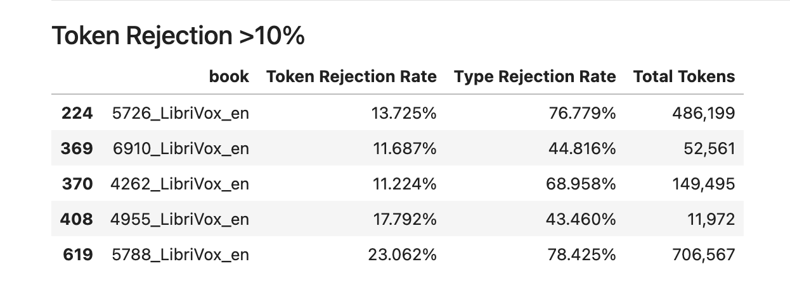
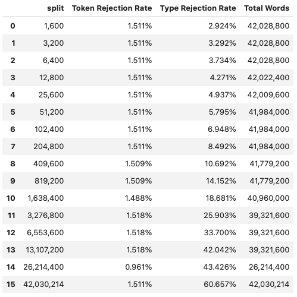
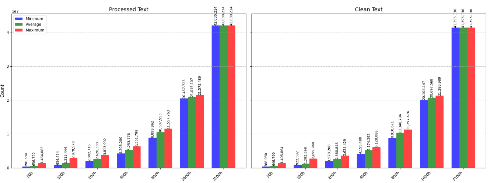
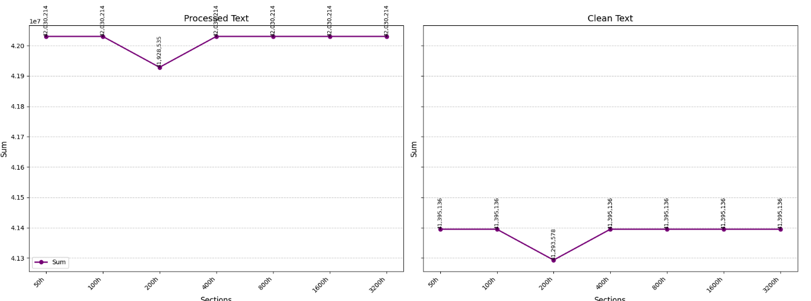
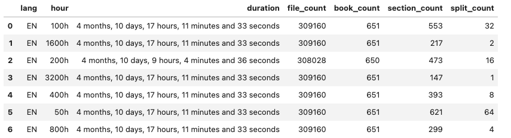

# STELA Dataset

The STELA Dataset contains 3,200 hours of speech in both English 
and French. For this experiment we are only using the English subset.

The audio is extracted from audiobooks from the Librivox website.
The text has been scrapped from the same source as well.

For each training language (English or French), training splits are 
created by randomly splitting the whole set of audio segments into 
mutually exclusive training sets of 50 hours. These 50-hours training 
sets were then merged two by two to build the 100-hours training sets.
116 This procedure was repeated until convergence, which left us with 
64, 32, 16, 8, 4, 2, and 1 training sets of 50h, 100h, 200h, 400h, 800h, 1,600h and 3,200h of speech.

## Original Dataset Structure

```
InfTrain
├── metadata
├── symlinks
├── text
├── trees
└── wav
```

The dataset is structured in the following way :

1. wav

The wav folder contains audio files separated into folders based on the 
language and book they belong to. 

4. text

Contains the transcript of the audio by bookname.
To link audio and text use the `metadata/matched2.csv` reference file.

2. trees

The trees folder contains an XML representation of how to rebuild the 
data splits.

3. symlinks

Contains a folder representation of the data split into the various 
subsplits base on the XML representaiton. The audio has been symlinked 
to reduce storage size.

4. metadata

Contains various metadata and metrics.

# Data preparation

In this study we only use the transcriptions of the datasets.

Format Dataset into the wanted architecture. This procedure extracts 
audiobook transcriptions from the original dataset and sorts them into 
the same splits as the audio files. The final structure we obtain is 
the following : 

```
├── metadata
│   ├── audio_durations.csv
│   ├── audio_durations.detailed.csv
│   ├── book_audio_durations.csv
│   ├── rjwf  # rejected word-frequencies
│   ├── unwf  # raw word-frequencies
│   ├── wav_text_associations.csv
│   └── wf  # word frequencies
├── rj_txt  # Rejected Words
│   └── EN
├── src
│   ├── original -> /scratch1/projects/InfTrain/dataset/
│   └── preprocessed
│       └── LANG
│           ├── HOUR_SPLIT
│           │   ├── SECTION_SPLIT
│           │   │   ├── transcription.meta.json
│           │   │   ├── transcription.preprocessed
│           │   │   ├── transcription.raw
│           │   │   └── word-frequencies.csv
│           ...
├── txt
│   ├── LANG
│   │   ├── HOUR_SPLIT
│   │   │   ├── SECTION_SPLIT
│   │   │   │   ├── books.txt
│   │   │   │   ├── trancription.txt
│   │   │   │   └── word-frequencies.csv
│   │   │   ├── ...
│   │   ├── ...
│   │   ...

```

- txt : folder containing transcriptions
    - LANG: corresponds to the given language
    - HOUR_SPLIT: corresponds to the size of the section splits in number of hours of speech,
                formatted as (50h, 100h, ..., 3200h) with equal
                quantity of speech among them (in diffent number of sections).
    - SECTION_SPLIT: separation of content into sections with equal     
        amount of speech content.
    - books.txt: the list of books used for this split
    - transcript.txt: the agregated transcripts of the audiobooks in the list.
    - word-frequencies.csv: Word - Frequency mapping of the transcripts.
- src: source material
  - original: link to the original STELA dataset
  - preprocessed: intermidiary step during cleaning
    - transcription.meta.json: metadata kept during text preprocessing.
    - transcription.preprocessed: clean text before word validation
    - transcription.raw: aggregated text without any processing
    - word-frequencies.csv: word frequency of raw text (tokenization not valid for anything other that cleanup stats).

- metadata:
    - audio_durations.csv: duration of audio of each split
    - audio_durations.detailed.csv: duration of each audio file
    - book_audio_durations.csv: audio duration of each book
    - wav_text_associations.csv: copy of original `metadata/matched2.csv`
    - rjwf: detailed word-frequencies of all the rejected words per split.
    - unwf: detailed word-frequencies of all preprocessed (before word validation) per split.
    - wf: detailed word-frequencies of all final text.


## Data Interface

For accessing all the assets of the dataset an interface class has
been created :

```python
from lexical_benchmark.datasets import stela

dataset = stella.STELATranscriptDataset(root_dir=...)
```

See `lexical_benchmark.datasets.stela.data.STELATranscriptDataset` for more details.


# Cleaup Procedure

The first step in the clean up is the reFormatting of the source dataset
into a structure that suits the needs of this study.

That is done mostly by relying on the original splits and using 
`metadata/matched2.csv` text-wav associations we recreated the same 
splits as the original dataset using the transcriptions of the audio books.

Second step is the preprocessing in this step we remove all unwanted 
parts of the transcriptions, badly formatted section, unwanted characters etc..
Here are the filters we used (Order Matters):

1) Illustration tag removal ([Illustration])
2) URL removal
3) TextNormalisation : correct accents & remove non-printable characters
4) Trancribe numbers
5) Remove roman numerals
6) Fix symbols ($,€, etc..)
7) AZFilter

    * replace '-' with a space to extract hyphenated words (fifty-five -> fifty five)

    * Keeps apostrophe char(*'*) to protect shorthands (ex: ain't)
  
    * purges everything not between [A-Z].

    * lowecases everything

8) Fix words by removing prefix and trailing quote char (')


This creates the preprocessed dataset, that we can now tokenize into 
words and pass it through a dictionairy to keep only valid english 
words.

For the English dictionairy we used the following sources : 

1. [kaikki](https://kaikki.org/index.html): list of words and phrases in machine reading format (JSONL) scrapped from wiki dictionairy 

2. [SCOWLv2](http://app.aspell.net/create): Open-source dictionairy of words, used mostly for spellchecking by a lot of open-source projects (Mozzila, Open-Office, etc..q)

3. [YAWL](https://github.com/elasticdog/yawl): Open-source dictionairy of words used to create crossword-type board games.


We filter all of the words found in a dataset and separate them into 
accepted & rejected based on if they are found in our combined 
dictionairy.


## Cleanup stats

##### Average Rejection Rates per split

We extract word frequencies pre and post word-validation and then 
we compute the rejection rate for each split, we then average the splits
for each category (50h, 100h, etc..)



##### Average Rejection Rates using chunk-average

To verify that our rejection rates are not altered by the size of the dataset. We take the largest set that contains all our data, and we 
proceed to  cut it into chunks of given size.

```
1600,
3200,
6400,
12_800,
16_000,             # 16k (will be used to compare with CHILDES)
25_600,
51_200,
102_400,
204_800,
409_600,
819_200,             # ~50h
1_638_400,           # ~100h
3_276_800,           # ~200h
6_553_600,           # ~400h
13_107_200,          # ~800h
26_214_400,          # ~1600h
len(WORDS_3200h_00)  # ~3200h
```




# Data Verification

As there were some issues (bugs & doubt on accuracy of measures), we 
also performed some checks on the data itself to verify accuracy of 
split sizes.

We discovered during this exploration that : 

1. The chunk size inside each split is not necessairily equal:



2. The `200h` split has less content that the others:



3. The audio dataset has the same issue on the `200h` split with 8h of audio less than the others:



